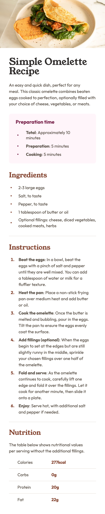

# Frontend Mentor - Recipe page solution

This is my solution to the [Recipe page challenge on Frontend Mentor](https://www.frontendmentor.io/challenges/recipe-page-KiTsR8QQKm). Frontend Mentor challenges help you improve your coding skills by building realistic projects. 

## Table of contents

- [Overview](#overview)
  - [The challenge](#the-challenge)
  - [Screenshot](#screenshot)
  - [Links](#links)
  - [Built with](#built-with)
  - [Useful resources](#useful-resources)
- [Author](#author)

## Overview

### Screenshot

### Links

- Solution URL: https://github.com/chaeh8n/recipe-page-main
- Live Site URL: https://chaeh8n.github.io/recipe-page-main/index.html

### Built with

- HTML
- CSS
- Media Queries
- Mobile-first workflow

### Useful resources

- [resource 1](https://fedmentor.dev/posts/responsive-meaning/) - This helped me with responsive design. 
- [resource 2](https://idkshite.com/posts/vertical-center-bullet) - This is what I used to center list bullet points vertically. 

## Author

- Github - [chaeh8n](https://github.com/chaeh8n)
- Frontend Mentor - [@Chaeh8n](https://www.frontendmentor.io/profile/Chaeh8n)
